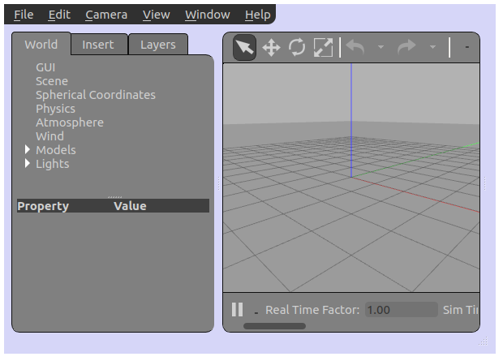

# Custom Gazebo style

GUI plugin that changes Gazebo's [QSS stylesheet](https://doc.qt.io/qt-5/stylesheet-syntax.html).

## Build

```
hg clone https://github.com/chapulina/custom_gazebo_style
cd custom_gazebo_style
mkdir build
cd build
cmake ..
make
```

## Run

```
cd custom_gazebo_style
gazebo --gui-client-plugin libcustom_gazebo_style.so
```

You'll see a light blue gazebo:



Learn more about GUI plugins in [this tutorial](http://gazebosim.org/tutorials?tut=gui_overlay).

## Modify

The `custom_style.qss` file in this repository is a copy of Gazebo's
`style.qss`, with one line changed to make the background blue.

Change that file as you wish and recompile the plugin to create new styles!
