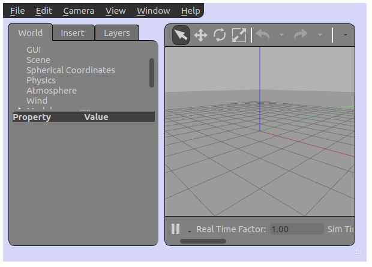
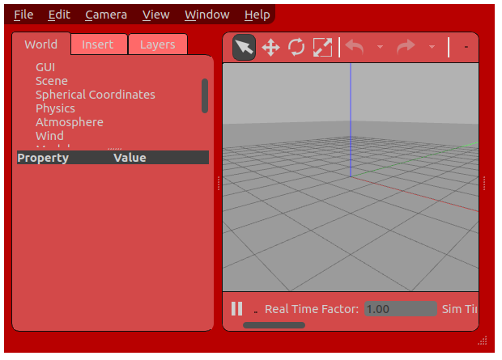
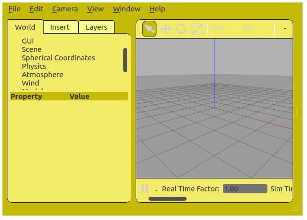
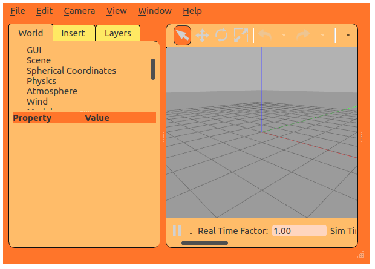
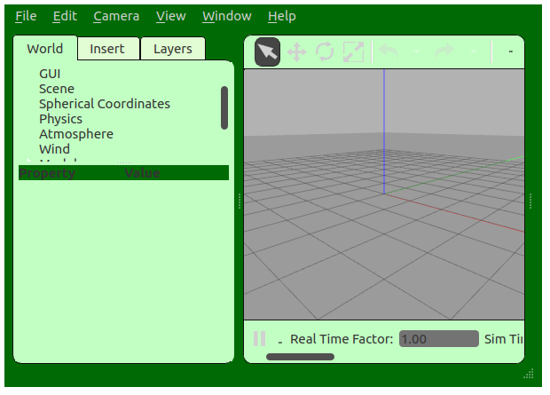

# Custom Gazebo style

GUI plugin that changes Gazebo's [QSS stylesheet](https://doc.qt.io/qt-5/stylesheet-syntax.html).


## Build

```
hg clone https://github.com/chapulina/custom_gazebo_style
cd custom_gazebo_style
mkdir build
cd build
cmake ..
make
```

## Run

```
cd custom_gazebo_style/build
GAZEBO_PLUGIN_PATH=`pwd` gazebo --gui-client-plugin libcustom_gazebo_style.so
```

You'll see a light blue gazebo:



Learn more about GUI plugins in [this tutorial](http://gazebosim.org/tutorials?tut=gui_overlay).

## Modify

The `qss/custom_style.qss` file in this repository is a copy of Gazebo's
`style.qss`, with one line changed to make the background blue.

There are also a few other files under the `qss` folder with bright colored styles
that can also be used as references (but are probably too jaunty for actual use).
To use them, just change the filename in the `.cc` file.

Change the files as you wish and recompile the plugin to use them!

#### redish



#### yellowish



#### orangish



#### greenish



## Alternatives

Changing the style could be made more convenient for the end user. For example,
by having an option on the menu to load any QSS file at runtime, even if it
hasn't been compiled with the plugin. It just depends on your use case :wink:

